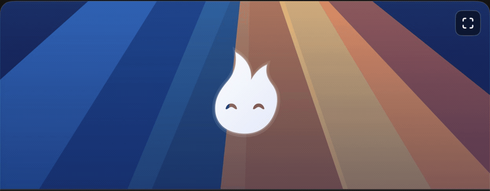
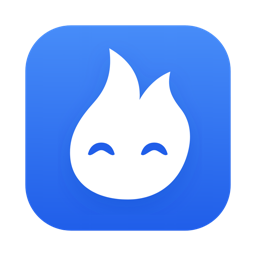
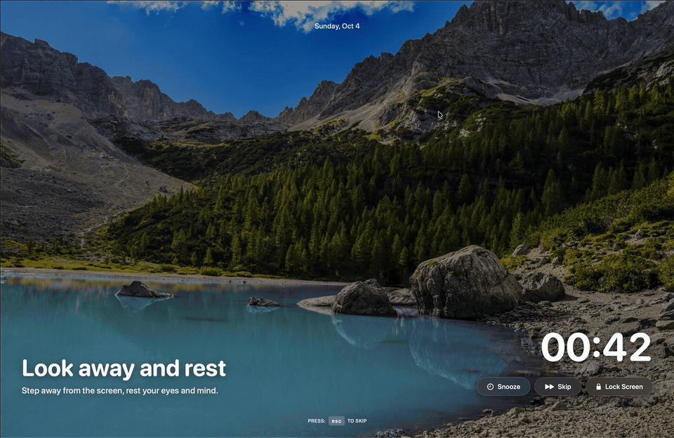
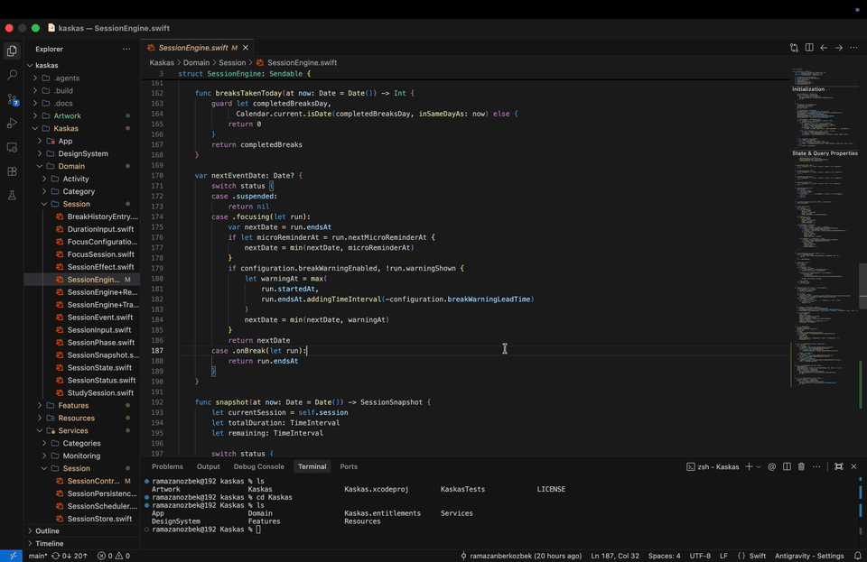
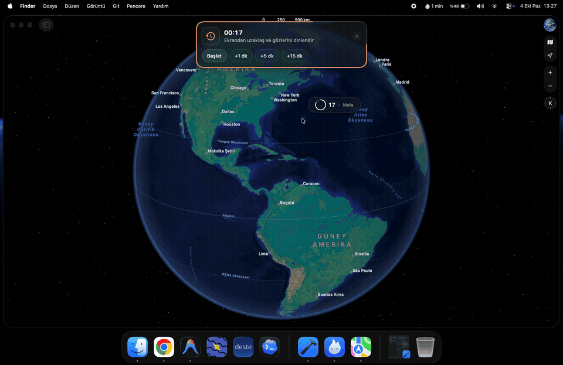
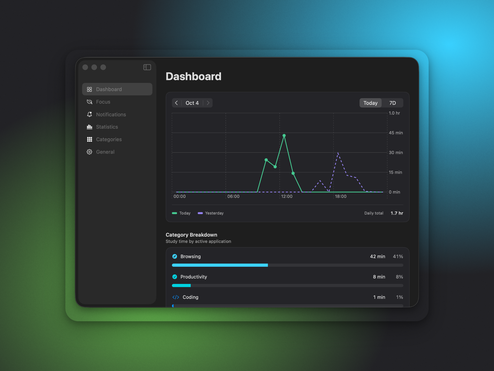
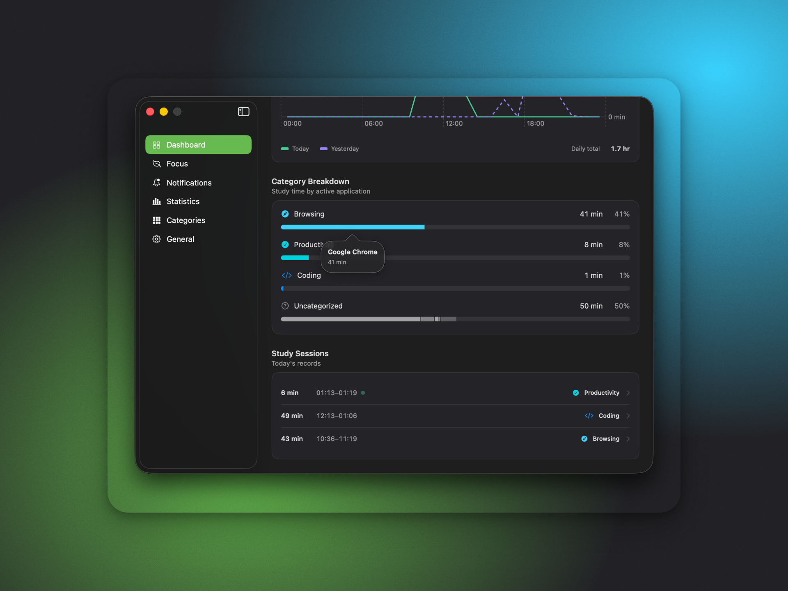
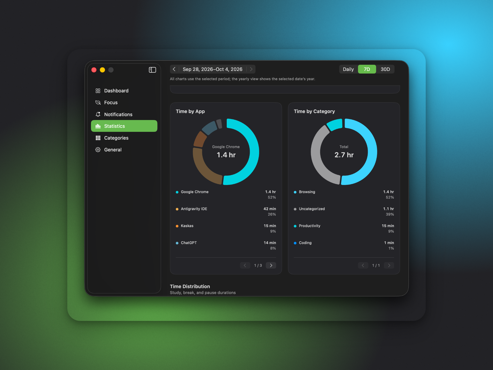
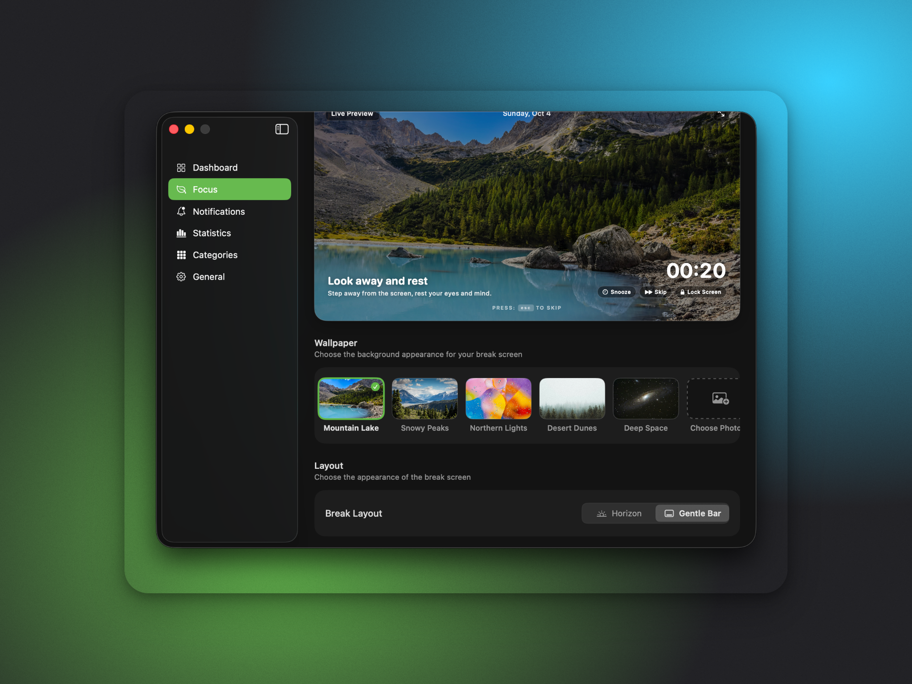

<div align="center">



<br/>



# Kaskas

A free, open source break reminder and focus tracker for macOS.<br/>
Rest your eyes and stay productive. Kaskas lives in your menu bar, tracks your study time and reminds you to rest before you burn out.

<br/>

<p>
  <a href="https://github.com/ramazanberkozbek/kaskas/releases/latest"></a>
  
  
  
  
  <a href="https://github.com/ramazanberkozbek/kaskas/stargazers"></a>
</p>

<br/>



<sub><b>Break screen</b> &nbsp;·&nbsp; a calm full-screen pause every 25 minutes</sub>

<br/>
<br/>




<sub><b>Micro-break reminder</b> &nbsp;·&nbsp; <b>Break warning</b></sub>

<br/>
<br/>




<sub><b>Dashboard</b> &nbsp;·&nbsp; <b>Study sessions</b></sub>

<br/>
<br/>




<sub><b>Statistics</b> &nbsp;·&nbsp; <b>Focus settings</b></sub>

</div>

## What it does

Kaskas helps you stay productive without burning out. It quietly tracks your focus time from the menu bar, reminds you to rest your eyes with 20-20-20 micro-breaks, and brings up full-screen pauses when it's time to step away—automatically holding off during meetings and keeping all your data private on your Mac.

## Why Kaskas

Long study and coding sessions are hard on your eyes, your neck and your
focus. Kaskas follows the idea behind the 20-20-20 rule: every 20 minutes a
short reminder to look away, and every 45 minutes a real break. It is built
with native SwiftUI and AppKit, so it feels like part of macOS rather than
another app fighting for your attention.

## Installation

1. Download **[Kaskas.dmg](https://github.com/ramazanberkozbek/kaskas/releases/latest/download/Kaskas.dmg)** (or browse [all releases](https://github.com/ramazanberkozbek/kaskas/releases)).
2. Open the DMG and drag **Kaskas** into your **Applications** folder.
3. Open Kaskas and enjoy healthy breaks.

## Build from source

Kaskas runs on **macOS 15 Sequoia or later**.

```bash
git clone https://github.com/ramazanberkozbek/kaskas.git
cd kaskas
open Kaskas.xcodeproj
```

Then pick the `Kaskas` scheme in Xcode and press <kbd>⌘</kbd> <kbd>R</kbd>.

## Privacy

No account, no ads, no analytics and no backend. Kaskas is sandboxed and
everything it records (sessions, app usage and settings) stays on your Mac.
Meeting protection only checks *whether* the microphone or camera is in use;
audio and video are never recorded.

## Contributing

Bug reports, ideas and pull requests are welcome. For anything big, please
open an issue first so we can talk it through.

## License

The code is licensed under the [GNU General Public License v2.0](LICENSE).
The break wallpapers come from [Unsplash](https://unsplash.com/license);
[PhotoCredits.md](Artwork/PhotoCredits.md) lists every photographer.

## Star history

<a href="https://www.star-history.com/#ramazanberkozbek/kaskas&Date">
 <picture>
   <source media="(prefers-color-scheme: dark)" srcset="https://api.star-history.com/svg?repos=ramazanberkozbek/kaskas&type=Date&theme=dark" />
   <source media="(prefers-color-scheme: light)" srcset="https://api.star-history.com/svg?repos=ramazanberkozbek/kaskas&type=Date" />
   
 </picture>
</a>
